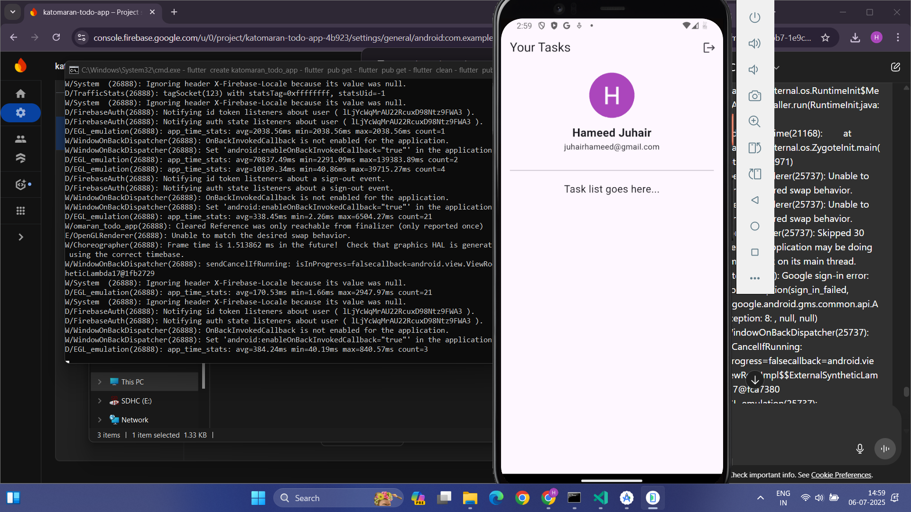
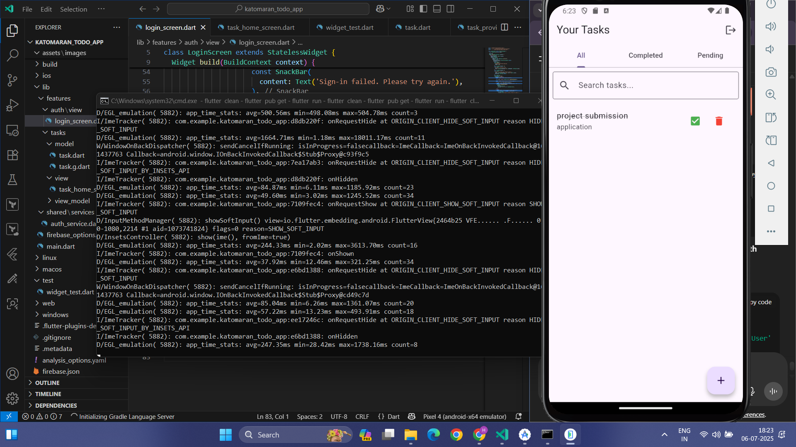
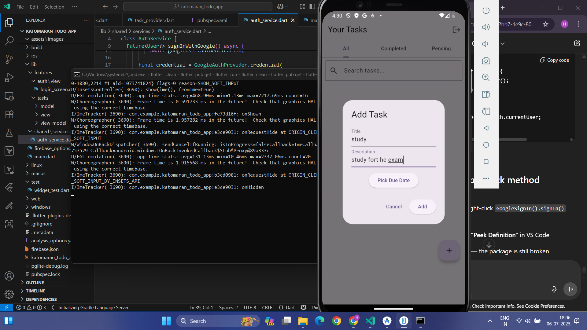

# Katomaran Todo Task Management Mobile App

This project is a cross-platform Todo Task Management Mobile Application built using **Flutter**. It enables users to authenticate using **Google Sign-In** and manage their personal tasks seamlessly.

---

## 🔥 Features

* ✅ Google Authentication (via Firebase)
* 📝 Add, View, Update, Delete Tasks
* 📅 Task Fields: Title, Description, Due Date, Status
* 🔄 Task Status: Open / Completed
* 🔍 Search, Tabs & Filters for All/Completed/Pending tasks
* ➕ Floating Action Button to add tasks
* 🧼 Empty state UX for no tasks
* 🔁 Pull-to-refresh & Swipe-to-delete
* ⚠️ Error handling for login and task operations
* 🎯 Clean, modern UI with responsive layouts
* 📱 Runs on both Android & iOS

---

## 🛠️ Tech Stack

| Layer            | Tech                                                             |
| ---------------- | ---------------------------------------------------------------- |
| Frontend         | Flutter                                                          |
| Authentication   | Google Sign-In via FirebaseAuth                                  |
| State Management | Provider                                                         |
| Backend          | Firebase (Authentication + optional Firestore for persistence)\* |
| Crash Reporting  | Firebase Crashlytics *(optional)*                                |

> *\*In this version, tasks are stored locally within the session.*

---

## 🧑‍💻 Setup Instructions

### 1. Clone the Repository

```bash
git clone https://github.com/YOUR_USERNAME/katomaran-todo-app.git
cd katomaran-todo-app
```

### 2. Install Dependencies

```bash
flutter pub get
```

### 3. Firebase Configuration

* Create a project on [Firebase Console](https://console.firebase.google.com)
* Enable **Google Authentication**
* Download `google-services.json` and place it inside `android/app/`

### 4. Run the App

```bash
flutter run
```

> Ensure your emulator/device is connected.

---

## 📸 Screenshots

| Login                           | Task Home (All/Completed/Pending) | Add Task                              |
| ------------------------------- | --------------------------------- | ------------------------------------- |
|  |      |  |

---

## 🗂️ Folder Structure (Simplified)

```
katomaran_todo_app/
├── android/
├── build/
├── ios/
├── lib/
│   ├── features/
│   │   ├── auth/
│   │   └── tasks/
│   ├── shared/
│   │   ├── services/
│   │   └── widgets/
│   └── main.dart
├── screenshots/
│   ├── login.png
│   ├── home.png
│   ├── add_task.png
│   └── architecture.png
├── pubspec.yaml
├── README.md
├── .gitignore
└── other Flutter files (like test/, metadata, etc.)

```

---

## 📐 Architecture Diagram

*+-----------------------------+
|           UI Layer          |
+-----------------------------+
|                             |
|  [Login Screen]             |
|      |                      |
|      v                      |
|  [Home Screen]              |
|      |                      |
|      v                      |
|  [Add/Edit Task Screen]     |
|                             |
+-----------------------------+
         |         |         |
         v         v         v
+-----------------------------+
|        Shared Widgets       |
+-----------------------------+
|  TaskCard  TaskInputForm    |
|  FilterTabs                 |
+-----------------------------+
         |
         v
+-----------------------------+
|        State Layer          |
+-----------------------------+
|  Provider (User State,      |
|  Task List State)           |
+-----------------------------+
         |
         v
+-----------------------------+
|        Service Layer        |
+-----------------------------+
|  Auth Service (Google Sign-In)|
|  Task Service               |
+-----------------------------+
         |         |
         v         v
+-----------------------------+      +-----------------------------+
|         Data Layer          |      |     (Optional Services)      |
+-----------------------------+      +-----------------------------+
|  Local Task Data (In-memory |      |  Firebase Firestore (Sync)   |
|  or SharedPreferences)      |      |  Firebase Crashlytics        |
|  Firebase Authentication    |      +-----------------------------+
+-----------------------------+*

---

## 📹 Demo Video
📱 KATOMARAN TODO TASK MANAGEMENT APP - VIDEO DEMO

👋 Hi, I’m Hameed Juhair. This is my submission for the Katomaran Mobile App Hackathon.

🛠️ Tech Stack:
- Flutter (Frontend)
- Google Sign-In using Firebase Authentication
- Provider for state management
- Tasks stored in local state for the session

---------------------------------------------------
✅ 1. Launch the App

- This is the home screen.
- The user is prompted to log in using Google.

---------------------------------------------------
🔐 2. Google Sign-In (Authentication)

- Clicking the “Sign In with Google” button opens the account selector.
- Once authenticated, the user is redirected to the Task Home screen.
- If login fails, appropriate error messages are shown.

---------------------------------------------------
🏠 3. Task Home Screen

- The home screen shows all tasks under 3 tabs: All, Completed, Pending.
- It uses a Floating Action Button (FAB) to add a new task.
- Pull-to-refresh is supported.
- If there are no tasks, an empty state message is shown.

---------------------------------------------------
📝 4. Adding a Task

- Click the “+” FAB to open the Add Task Dialog.
- Enter the title, description, due date, and priority.
- Click “Save” to add the task to the list.
- A short animation shows the new task being added.

---------------------------------------------------
✏️ 5. Editing & Updating Tasks

- Click on an existing task to edit it.
- Update the title, date, or mark as completed.
- The task list updates instantly using Provider.

---------------------------------------------------
✅ 6. Marking Task as Complete

- Click the checkbox to mark a task as completed.
- The task moves to the “Completed” tab.
- You can uncheck it to move it back to pending.

---------------------------------------------------
🗑️ 7. Swipe to Delete

- Swipe a task card left or right to delete it.
- A confirmation message is shown.
- This improves UX with quick actions.

---------------------------------------------------
⚙️ 8. Features Summary

- Fully functional CRUD on tasks.
- Google Sign-In for secure login.
- Responsive design for Android/iOS.
- Error states and animations for a polished feel.

---------------------------------------------------
📐 9. Architecture

- UI built in Flutter.
- State managed using Provider.
- Google Auth via Firebase.
- Tasks stored in-memory for now.
- Modular file structure with reusable widgets.

---------------------------------------------------
🎯 10. Final Words

- This project is a part of a hackathon run by https://www.katomaran.com.
- I hope you enjoyed the demo.
- Thank you for reviewing my submission!


## 📹 Demo Video

[Watch Demo on ScreenRec](https://screenrec.com/share/HbwgOY6e3o)


---
## 📱 Download APK

[⬇️ Download Katomaran Todo App (v1.0.0)](https://github.com/Hameedjuhair/katomaran-todo-app/releases/download/v1.0.0/app-release.apk)


## 📝 Assumptions

* Task data is stored in local state for the session (no database).
* Only Google Sign-In is implemented due to scope.
* Flutter used for rapid cross-platform development.

---

## 📄 License

MIT License *(if applicable)*

---

## 🙌 Credits

This project is a part of a hackathon run by [https://www.katomaran.com](https://www.katomaran.com)

---
